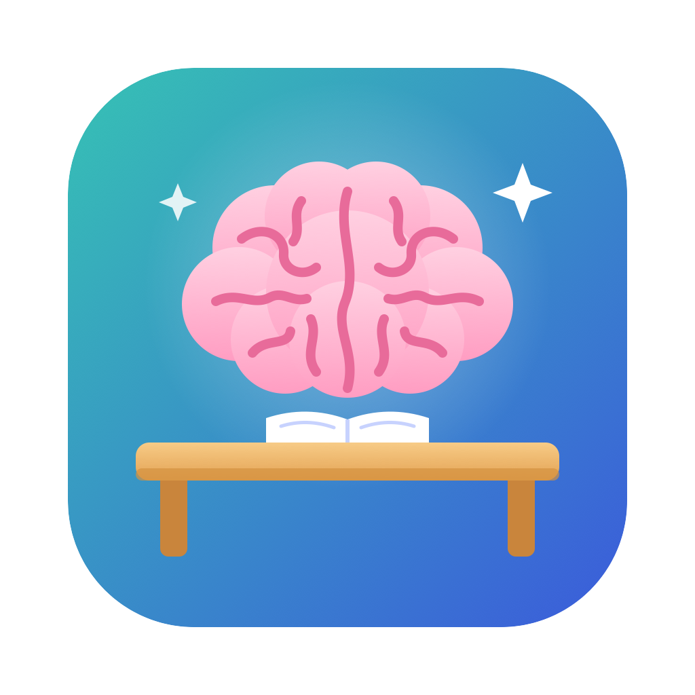

# EqualEd



**One camera, one microphone, one set of models: classroom support for neurodivergent students.**

EqualEd watches a classroom in real time and steps in when a student is struggling.
Everything runs on the student's laptop. Video and audio never leave the device.

| Mode | Who it helps | What it does |
|---|---|---|
| Sensory shield | Autistic students | Spots things that are about to get loud or overwhelming, starts a calming sound in the student's AirPods *before* the noise, and alerts the professor when the student shows signs of overload. |
| Lecture rewind | Students with ADHD | Marks the moments the student looked away or picked up their phone, transcribes the lecture, and answers "What did I miss about X?" with exactly those minutes. |
| Reading help | Students with dyslexia | Lean in toward the screen when a paragraph is hard and it reads that paragraph aloud. |

## How it works

| Layer | Model | Job |
|---|---|---|
| People | YOLO11-pose | Body joints and face points for every person, tracked over time |
| Loud things | YOLOE (open vocabulary) | Finds a blender, drill, vacuum, dog, megaphone... by name, before they make a sound |
| Sound | Loudness reflex + YAMNet | Confirms the loud moment and scores how early the camera predicted it |
| Lecture | Whisper (offline) | Live transcript for the ADHD rewind |
| Live scene reasoning | **NVIDIA Cosmos3-Reason** (CoreWeave GPU) | Every few seconds reads the last 3 s of video: "what is about to get loud, crowded or overwhelming, and why". Explains each overload moment to the professor. |
| Lecture (hosted) | **NVIDIA Canary-1B** (CoreWeave GPU) | Lecture transcript; Whisper on the Mac is the fallback |
| Archive | **VAST DataEngine + VastDB** (Cosmos3-Reason, YOLO11, Cosmos Embed1) | "Sensory map": searches the indexed footage for triggers and ranks places from most overwhelming to calmest |
| Answers | **Weights & Biases** inference, then Claude | "What did I miss?" (only the transcript text is sent, only when asked) |

**10 sensory triggers:** crowding around the student, someone in personal space, someone approaching fast,
rapid movement nearby, commotion, a person standing up, several people getting up, a chair moved or tucked in,
flicker or sudden light change, sudden loud noise.

**Student reactions it watches for:** covering ears, rocking, head down. When one happens it links the
reaction to the triggers just before it, plays the calming sound, and notifies the professor.

**Learning:** every moment on the dashboard has *Bothered me* / *Was fine* buttons. Things that bother
this student make the risk meter react sooner. The profile is stored only on the laptop.

## Run it (Mac with Apple Silicon, Python 3.11)

Keep the project outside Desktop/Documents/Downloads (e.g. `~/EqualEd`) so the app needs no folder permissions.

```bash
./setup.sh               # installs packages, downloads the sound model, runs an offline self-test
./make_app.sh --install  # builds EqualEd.app with its icon and copies it to /Applications
open -a EqualEd          # or Spotlight / Launchpad
```

### Connect the hackathon stack (VAST + NVIDIA on CoreWeave + W&B)

Copy `vast.env.example` to `vast.env` and paste the values from the workshop VM's `/config/<team>.config`
(`GPU_BEARER_TOKEN`, `INGRESS_URL`, `USERNAME`, `PASSWORD`, `WANDB_*`). `vast.env` is git-ignored.
Without it everything still runs locally; the dashboard shows which parts are connected.

To make the archive searchable for sensory load, re-ingest a pack (e.g. Pack F, indoor smart spaces) on the VM
with the custom prompt shown in the dashboard's *Sensory map* tab.

Click **Allow** for the camera and microphone. The terminal log (`run.log`) prints two links:

- **Student dashboard**: risk meter, predictions, trigger profile, lecture rewind, reading help.
- **Professor page**: open it on a phone on the same Wi-Fi to get overload alerts and tap "I'm on my way".

Optional: put a Claude API key in `.env` (see `.env.example`), or sign in to Claude Code, so "What did I miss?" uses Claude.
Without it, it falls back to an offline search of the transcript.

### Video window keys

| Key | Action |
|---|---|
| click a person | make them "the student" |
| click empty space | solo test mode |
| s | simulate an overload moment |
| m | stop the calming sound |
| b / f | mark the last moment "bothered me" / "was fine" |
| l | simulate leaning in (reading help) |
| r | start/stop a backup recording |
| a / c / q | auto-pick student / switch camera / quit |

### Settings (`config.json`)

- `student_name`: shown to the professor.
- `allow_speakers`: `false` keeps sounds in the AirPods only. Turn on for stage demos (also a toggle in the dashboard).
- `camera_url`: stream from a wireless camera board (e.g. XIAO ESP32S3 Sense) instead of the webcam.
- `adhd_away_seconds`: how long looking away counts as an attention drop.

Other ways to run: `.venv/bin/python sensory_demo.py --video classroom.mp4` (a recording) or `--selftest`.

## Privacy

- Video and audio are processed on the laptop and never uploaded.
- Snapshots, transcripts and the trigger profile stay in local folders that are git-ignored.
- The web pages work only on the same Wi-Fi and need a secret link.
- "What did I miss?" sends only lecture transcript text to W&B or Claude, only when the student asks.
- Live Cosmos reasoning (only when `GPU_BEARER_TOKEN` is set) sends 3-second, 480p clips to the hackathon's
  Cosmos3-Reason server. Leave the key out to keep all video on the laptop.

## Status and limits

Hackathon prototype. Thresholds are first guesses and have not been tested in a real classroom.
A flat camera has no depth, so "close" is estimated from body size. The loud-object finder can mistake
small faraway shapes for objects, so tiny detections are ignored. Not a medical device.
